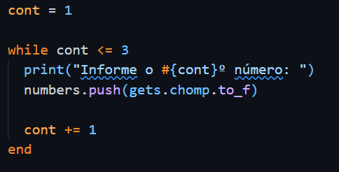
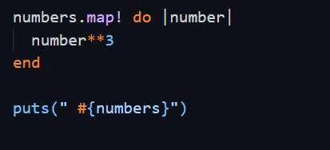

# 🔢 Cálculo com potência

## Objetivo Geral

- Criar um programa que utilize a função matemática potência

### Desafio

- Criar um array vazio, para que o usuário insira 3 números e no final apareça o resultado desses 3 números elevados a 3ª potência

### Como o código foi desenvolvido

- Após criação do array, foi criado um loop para solicitar 3 números ao usuário

  - Posteriormente, por meio da estrutura de repetição map!, o conteúdo do array foi alterado para receber os valores originais elevados a 3ª potência

  